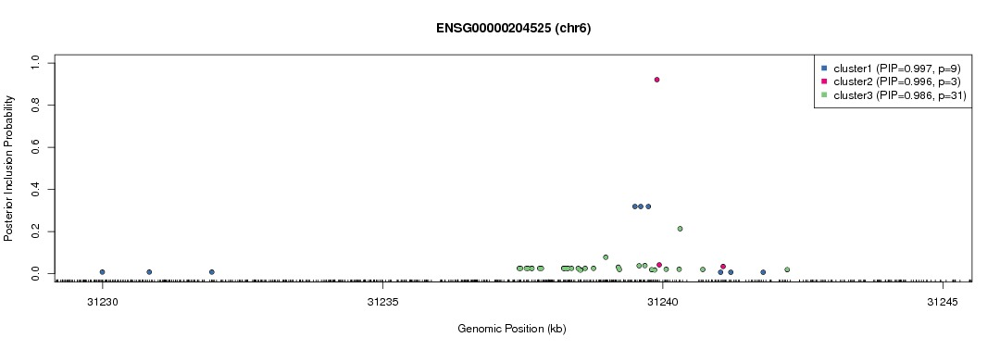
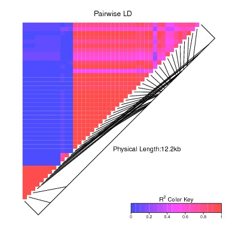

# Utility Scripts

## 1. Plotting DAP results

The utility script ```plot_dap``` helps visualizing the DAP fine-mapping results. It provides a scatter plot of PIPs for all member SNPs in a noteworthy signal cluster (cluster PIP > 0.50) identified in each association signal cluster. A complementry LDHeatmap plot is also provided to illustrate the correlation between genotypes of each plotted SNP. 

### 1.1 Setup

First download the perl script ```plot_dap``` and R script ```DAP_plot.R```. The R script is invoked internally by ```plot_dap```, but need to be place in a directory that is accessible. For the first usage, the path to ```DAP_plot.R``` needs to be specified to ```plot_dap``` via the ```-Rpath``` option.

```DAP_plot.R``` requires the R package ```LDheatmap```. Install the package using the command

```
install.packages("LDheatmap")
```
Note, a dependent package ```chopsticks``` required by ```LDheatmap``` may need to be installed first from Bioconductor using the following command

```
source("https://bioconductor.org/biocLite.R")
biocLite("chopsticks")
```


### 1.2 Plotting data

The command line for plotting the DAP data is
```
plot_dap -d dap_output_file -s sbams_input_file -m map_file -gene gene_name [-Rpath directory_containing_DAP_plot_dot_R] [-t snp_level_pip_threshold]
```
where

* ```dap_output_file```:  the output file from ```dap-g```
* ```sbams_input_file```: the input sbams file for ```dap-g``` run
* ```map_file```: map file containing genomic position info for all SNPs in the sbams file
* ```snp_level_pip_threshold```: only SNPs with PIP above the specified threshold within a cluster will be plotted. The default value is set to 1e-3.

The map file is in text format and contains the following three columns
```
snp_name   chromosome   position
```

We have provided a set of examples in the ```plot_example_files``` directory. In our example file, the SNP is coded by its position information, and the map file can be simply made by the following one-liner

```
grep geno sbams_file | awk '{print $2, $2}' | sed 's/\(.*\)\./\1 /' > map_file
```


### 1.3 Output files

Two pdf files are output upon successful execution: one for the scatter pip plot and the other for the LD plot.







